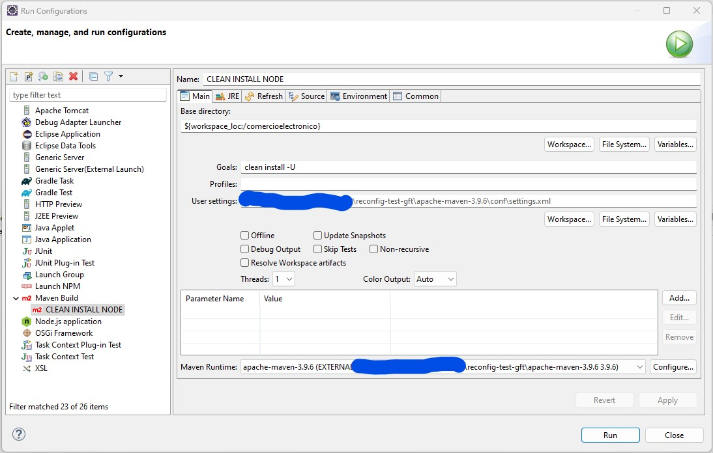
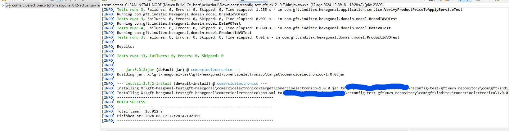
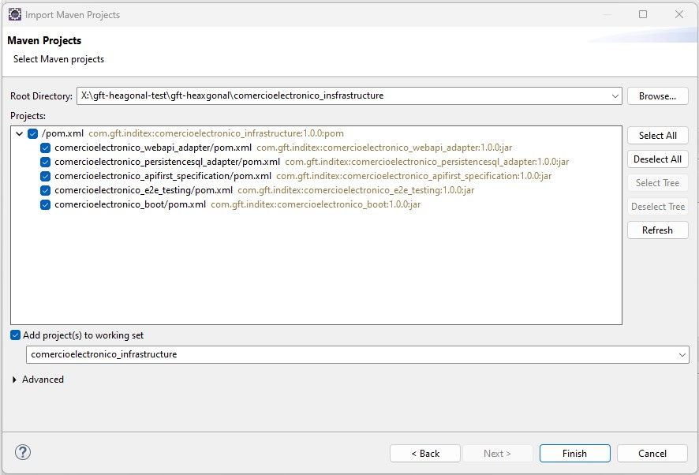
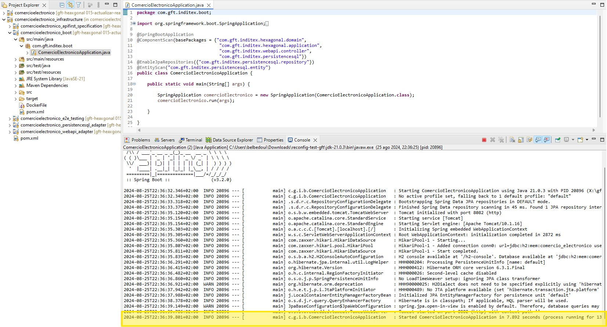
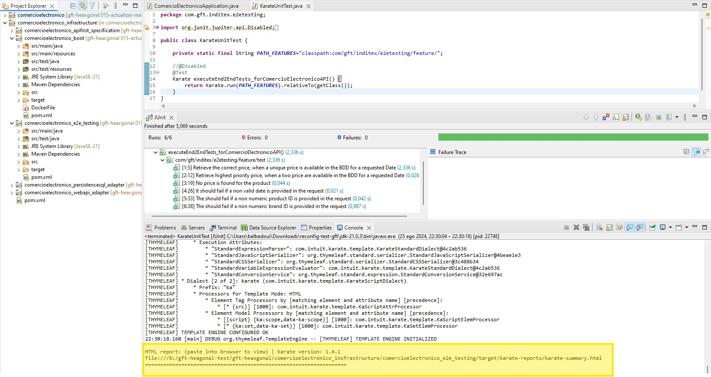

# PRUEBA TÉCNICA USANDO ARQUITECTURA HEXAGONAL

## Descripción: 
  Proyecto Java/SpringBoot multimodulo dockerizado usuando arquitectura hexagonal, specificacion API FIRST y test e2e.
  Se usa una base de datos H2.

## Funcionalidades: 

  - Recuperar el precio de un producto de una tienda del grupo a una fecha dada. Pudiendo tener varios precios disponible para ese instante, usando la prioridad como Desambiguador.

## Installación

### Herramientas para la instalación del proyecto

 - eclipse (IDE): https://www.eclipse.org/downloads/download.php?file=/technology/epp/downloads/release/2024-06/R/eclipse-jee-2024-06-R-win32-x86_64.zip&mirror_id=1045
 - java SE 21: https://download.oracle.com/java/21/latest/jdk-21_windows-x64_bin.zip
 - Maven 3.9.6 : https://dlcdn.apache.org/maven/maven-3/3.9.6/binaries/

### Configuracion de los proyectos: comercioelectronico (Núcleo, contiene nuestro y la implementacion de la lógica de negocio) y comercioelectronico_insfrastructure (contiene los adapters web, persitencia, y e2e tests)

- Configurar el jdk en nuestro workspace de ecplise

- Configurar maven, al igual que los parámetros de usuario(configuracion del setting.xml,       repositorio local)
  
  

- Una vez tenemos listo nuestro workspace. Empezaremos por el proyecto comercioelectronico (dominio y applicación), es una librería aislada y es el núcleo del proyecto.

  

- Configurar el BUILD (clean install) de nuestra libreria
  
  

- Ahora que  ya tenemos al dominio funcional, configuramos el proyecto con la infraestructura, que contiene los adaptadores web, persistencia...
  
  

- Configurar el BUILD del proyecto infra también
  

- Este deberia ser el resultado  que deberíamos obtener una vez configurado el proyecto el local
  

- Ejecutar el proyecto!! Siendo una api springboot, ya lleva incorporado las libreria de tomcat. Simplemente ejecutamos el MAIN como cualquier proyecto java.

Se ejecutará sobre el puerto 8082 
  

- Una vez el proyecto en ejecución. Lanzar los tests end-to-end des del modulo de testing.
  EJECUTAR LA CLASE KarateUniTest con JUNIT, rehabilitando la clase test comentando la annotación @Disabled.
  En la captura, podemos ver que karate tambien nos permite consultar el informe de los test en el navegador gracias al enlace que vemos.
  

- Para acceder a la BDD en memoria {url_server:puerto}/h2_console
  la configuración de acceso la entraréis el application.properties
  
