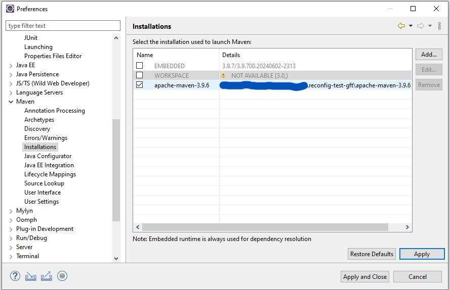
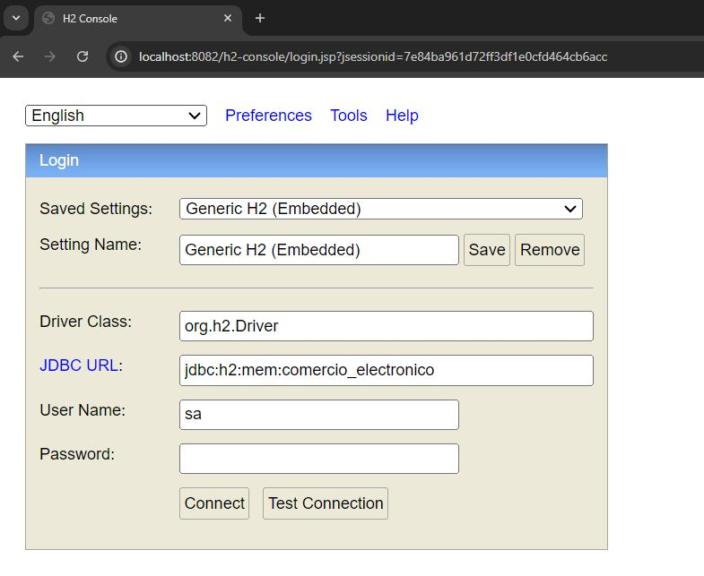

# PRUEBA TÉCNICA USANDO ARQUITECTURA HEXAGONAL

## Descripción: 
  Proyecto Java/SpringBoot multimodulo dockerizado usuando arquitectura hexagonal, specificacion API FIRST y test e2e.
  Se usa una base de datos H2.

## Funcionalidades: 

  - Recuperar el precio de un producto de una tienda del grupo a una fecha dada. Pudiendo tener varios precios disponible para ese instante, usando la prioridad     como Desambiguador.

## Installación

### Herramientas para la instalación del proyecto

 - eclipse (IDE): https://www.eclipse.org/downloads/download.php?file=/technology/epp/downloads/release/2024-06/R/eclipse-jee-2024-06-R-win32-x86_64.zip&mirror_id=1045
 - java SE 21: https://download.oracle.com/java/21/latest/jdk-21_windows-x64_bin.zip
 - Maven 3.9.6 : https://dlcdn.apache.org/maven/maven-3/3.9.6/binaries/

### Configuracion de los proyectos (DOMINIO y PROYECTO WEB)

- Configurar el jdk en nuestro workspace de ecplise

- Configurar de  maven, y también del parmateros del usuario(configuracion del setting.xml, repositorio local)
  
  

- Una vez tenemos listo a nuestro workspace, importamos EL DOMINIO que es un proyecto aislado y en el núcleo que contiene nuestra lógica de negocio

  

- Configurar el BUILD (clean install) de nuestra libreria
  

- Ahora ya que tenemos ya tenemos al dominio funcional, configuraremos el Proyecto web
  
  

- Configurar el BUILD del proyecto web también, pero esta vez DESACTIVANDO LOS TESTS para que no se lance el módulo de testing-e2e
  

- Este deberia ser el resultado  que deberíamos obtener una vez configurado el proyecto el local
  

- Ejecutar el proyecto!! Siendo una api springboot, lleva incorporado las libreria de tomcat, con ejecutar el MAIN como cualquier proyecto java es suficiente.
  Se ejecutará sobre el puerto 8082 
  

- Una vez el proyecto en ejecución. Lanzar los tests end-to-end des del modulo de testing.
  EJECUTAR LA CLASE KarateUniTest con JUNIT. En la captura, podemos ver que karate tambien nos permite consultar el informe de los test en el navegador gracias al enlace que vemos.
  

- Para acceder a la BDD en memoria {url_server:puerto}/h2_console
  la configuración de acceso la entraréis el application.properties
  

  

  

  
